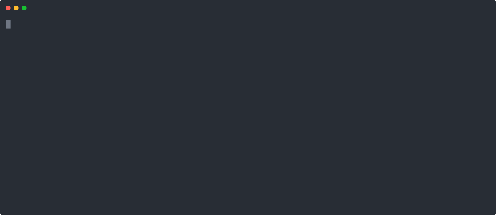

[](https://github.com/Tufin/oasdiff/actions)
[](https://codecov.io/gh/tufin/oasdiff)
[](https://goreportcard.com/report/github.com/tufin/oasdiff)
[](https://godoc.org/github.com/tufin/oasdiff)
[](https://hub.docker.com/r/tufin/oasdiff/tags)
[](https://join.slack.com/t/oasdiff/shared_invite/zt-1wvo7wois-ttncNBmyjyRXqBzyg~P6oA)


Command-line and Go package to compare and detect breaking changes in OpenAPI specs.

## Installation

### Install with Go
```bash
go install github.com/tufin/oasdiff@latest
```

### Install on macOS with Brew
```bash
brew tap tufin/homebrew-tufin
brew install oasdiff
```

### Install on macOS and Linux using curl

```bash
curl -fsSL https://raw.githubusercontent.com/tufin/oasdiff/main/install.sh | sh
```

### Install with asdf

https://github.com/oasdiff/asdf-oasdiff

### Manually install on macOS, Windows and Linux
Copy binaries from [latest release](https://github.com/Tufin/oasdiff/releases/)


## Try it

### Locally
```
oasdiff changelog https://raw.githubusercontent.com/Tufin/oasdiff/main/data/openapi-test1.yaml https://raw.githubusercontent.com/Tufin/oasdiff/main/data/openapi-test5.yaml
```

### With Docker
```
docker run --rm -t tufin/oasdiff changelog https://raw.githubusercontent.com/Tufin/oasdiff/main/data/openapi-test1.yaml https://raw.githubusercontent.com/Tufin/oasdiff/main/data/openapi-test5.yaml
```

## Features 
- Detect [breaking changes](BREAKING-CHANGES.md)
- Display a user-friendly [changelog](BREAKING-CHANGES.md) of all important API changes
- Generate comprehensive [diff](DIFF.md) reports including all aspects of [OpenAPI Specification](https://swagger.io/specification/): paths, operations, parameters, request bodies, responses, schemas, enums, callbacks, security etc.
- Output reports in YAML, JSON, Text, Markdown, HTML, JUnit XML or the [github actions annotation format](https://docs.github.com/en/actions/using-workflows/workflow-commands-for-github-actions#setting-a-warning-message)
- Compare local files or remote files over http/s
- Compare specs in YAML or JSON format
- [Compare two collections of specs](COMPOSED.md)
- [Deprecating APIs and Parameters](DEPRECATION.md)
- [API stability levels](STABILITY.md)
- [Multiple versions of the same endpoint](MATCHING-ENDPOINTS.md#duplicate-endpoints)
- [Merge allOf schemas](ALLOF.md)
- [Merge common (path-level) parameters](COMMON-PARAMS.md)
- [Case-insensitive header comparison](HEADER-DIFF.md)
- [Path prefix modification](PATH-PREFIX.md)
- [Path parameter renaming](PATH-PARAM-RENAME.md)
- [Excluding certain kinds of changes](DIFF.md#excluding-specific-kinds-of-changes)
- [Tracking changes to OpenAPI Extensions](DIFF.md#openapi-extensions)
- [Filtering endpoints](FILTERING-ENDPOINTS.md)
- [Extending breaking changes with custom checks](CUSTOMIZING-CHECKS.md)
- Localization: view breaking changes and changelog messages in local languages 
- [Customize with configuration files](CONFIG-FILES.md)
- [Run from Docker](DOCKER.md)
- [Integrate in GitHub](https://github.com/oasdiff/github-demo/tree/main)
- [GitHub Action](https://github.com/oasdiff/oasdiff-action)
- [Cloud Service](OASDIFF-SERVICE.md)
- [OpenAPI Sync: Get notified when an API provider breaks the API](https://github.com/oasdiff/sync/)
- [Embed in your go program](GO.md)

## Demo


## The main commands
- [diff](DIFF.md): the diff between OpenAPI specs, fully detailed
- [breaking](BREAKING-CHANGES.md): breaking changes between OpenAPI specs  
- [changelog](BREAKING-CHANGES.md): important changes between OpenAPI specs including breaking and non-breaking changes
- [flatten](ALLOF.md): replace all instances of allOf by a merged equivalent
- checks: displays the different checks that oasdiff runs to detect changes

## Roadmap
I am currently working on the ability to correlate breaking changes and changelog messages with the underlying changes in the original YAML spec.  
This will allow users to see changes in their original context, investigate, and determine how to handle them.  
Specifically, github users will be able to click annotations and see the diff at the relevant line as discussed [here](https://github.com/Tufin/oasdiff/issues/574).  
[Please help us prioritize the roadmap](https://github.com/Tufin/oasdiff/discussions/631).

## Credits
This project relies on the excellent implementation of OpenAPI 3.0 for Go: [kin-openapi](https://github.com/getkin/kin-openapi).

## Feedback
We welcome your feedback.  
If you have ideas for improvement or additional needs around APIs, please [let us know](https://github.com/Tufin/oasdiff/discussions/new?category=ideas).
